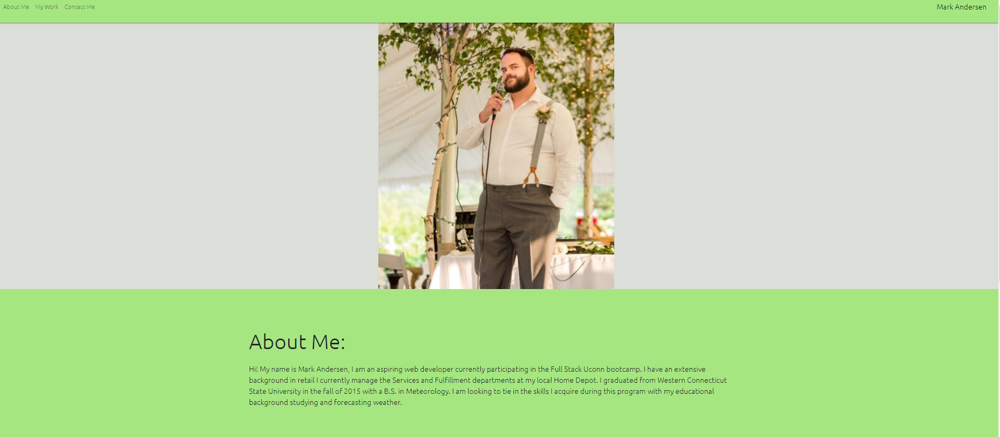
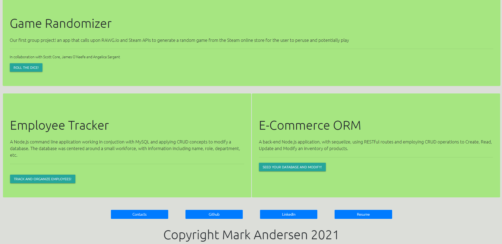
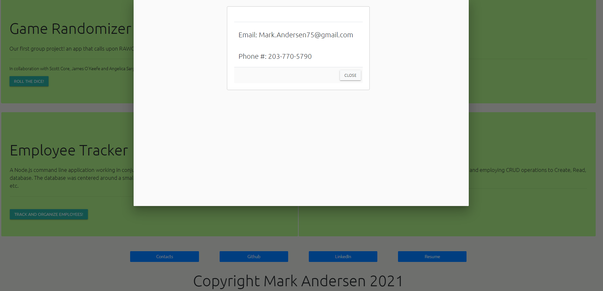
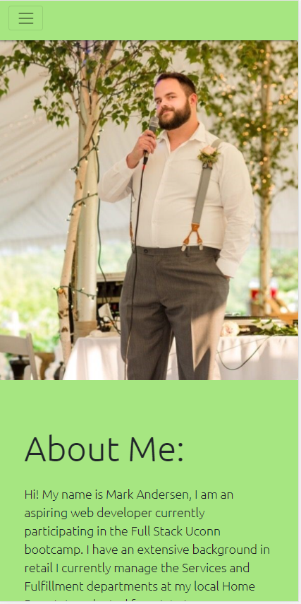
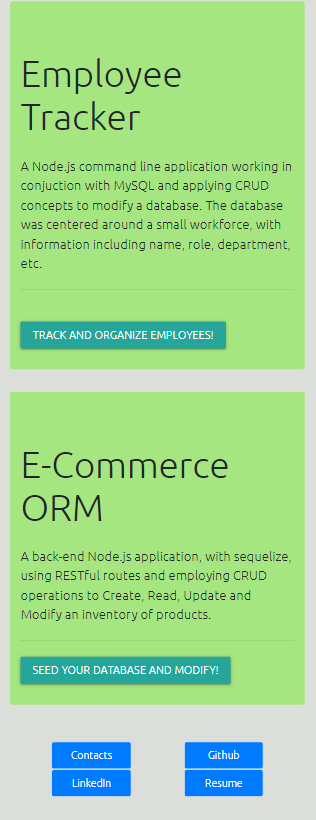

# Updated-Portfolio-2
Updated portfolio utilizing CSS libraries and including more recent work. This was an updated porfolio page utilizing bootstrap CSS library, Google fonts, and a small custom css file and javascript to initialize the the third party CSS library. The portfolio includes links to 3 highlighted projects. One being the collaborative group project "steam-roulette", and two back end applications: "Employee Tracker" and "E-Commerce-ORM". The portfolio includes contact information, a link to my Github profile, my LinkedIn profile, and a downloadable version of my resume.

## Examples

### Page on large screens

### Modal with Contact Info

### Mobile ready version with collapsed navbar and realigned jumbotron

## Links
https://markandersen.github.io/Updated-Portfolio/
 
https://github.com/MarkAndersen
 
https://www.linkedin.com/in/mark-andersen-042380105/